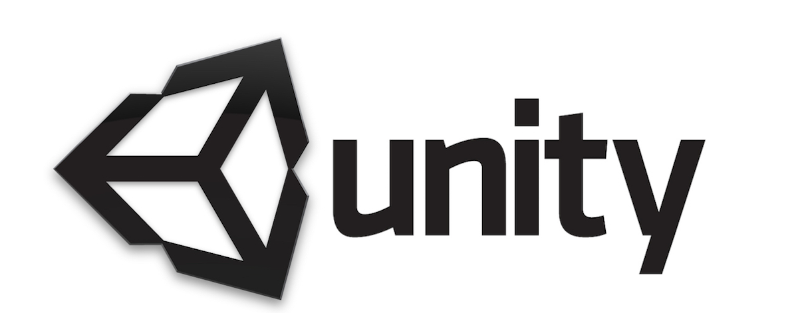

<h1><strong>Skilling Module 2 | Introduction to Physics using Unity</strong></h1>

Tutor: Octavian Gheorghiu

<h1><strong>Overview and purpose</strong></h1>

The class aims to introduce students to physics using the Unity game engine as a tool for design exploration and design communication. At the end of the class the students will build an app that showcases the skills they have developed.

<h1><strong>Education Standards</strong></h1>
<ol>
<li>Inspire, motivate and challenge students</li>
<li>Make productive use of assessments</li>
<li>Adapt classes to respond to strengths and needs of students</li>
</ol>
<h1><strong>Objectives</strong></h1>
<ol>
<li>Learn the necessary skills required to write and execute code</li>
<li>Learn the necessary skills to produce an app or a video game</li>
</ol>
<h1><strong>Materials Needed</strong></h1>
<ol>
<li>Unity Game Engine, Version 2020.21f1</li>
<li>Visual Studio Community 2019</li>
</ol>
<h1><strong>Verification</strong></h1>
<ol>
<li>All the objectives subcategories will be assessed by a small exercise that will require the students to use the newly learned skill</li>
<li>Skills development will require previous understanding of learned skills to proceed, thus showcasing when a necessary skill has yet to be learned</li>
<li>The final exercise will require the usage of most of the learned skills</li>
</ol>
<h1><strong>Lesson Plan</strong></h1>

Six sessions totalling 12 hours:

<ol>
<li>Session 1: Introduction to Physics Fundamentals</li>
<ol>
<li>Rigidbody Basics</li>
<li>Coliders</li>
<li>Trigger Events</li>
<li>Physics Materials</li>
</ol>
<li>Session 2: Physics Fundametals Continued</li>
<ol>
<li>Fixed Joints</li>
<li>Spring Joints</li>
<li>Hinge Joints</li>
<li>Configurable Joints</li>
</ol>
<li>Session 3: Unity ECS and DOTS</li>
<ol>
<li>What us ECS and DOTS</li>
<li>Rigidbody</li>
<li>Collision detection </li>
<li>Motion </li>
</ol>
<li>Session 4: Unity ECS and DOTS Continued</li>
<ol>
<li>Material properties</li>
<li>Distance queries</li>
<li>Colider casting and ray casting/li>
<li>Joints</li>
</ol>
<li>Session 5: Pacman Game using DOTS</li>
<ol>
<li>Project setup</li>
<li>Basic movment using ECS</li>
<li>DOTS Physics with ECS </li>
<li>Damage and Collsion with DOTS </li>
</ol>
<li>Session 6: Pacman Game using DOTS</li>
<ol>
<li>Game state</li>
<li>User Interface</li>
<li>Camera Control and Audio Control</li>
<li>Game export </li>
</ol>
</ol>
<h1><strong>Homework assignments</strong></h1>
<ol>
<li>Session 1 homework:</li>
<ol>
<li>Complete the Basics Physics Challange 1 at https://learn.unity.com/tutorial/challenge-1-basic-object-physics?uv=2019.4&projectId=5fa94976edbc2a3884083abc </li>
<li>Save videos of the completed challange</li>
<li>For a higher grade invent some other physics challanges and save videos of them</li>
</ol>
<li>Session 2 homework:</li>
<ol>
<li>Complete the Basics Physics Challange 2 at https://learn.unity.com/tutorial/challenge-2-physics-joints?uv=2019.4&projectId=5fa94976edbc2a3884083abc</li>
<li>Save videos of the completed challange</li>
<li>For a higher grade invent some other physics challanges and save videos of them</li>
</ol>
<li>Session 3 homework:</li>
<ol>
<li>Complete the Session 1 homework using DOTS and share videos using the new Physics Debug Mode</li>
</ol>
<li>Session 4 homework:</li>
<ol>
<li>Complete the Session 2 homework using DOTS and share videos using the new Physics Debug Mode</li>
</ol>
<li>Session 5 homework:</li>
<ol>
<li>Save a video of the project setup and the basic physics implemented in DOTS</li>
</ol>
<li>Session 6 homework:</li>
<ol>
<li>Save a video of the final game being played</li>
</ol>
</ol>
<h1><strong>Final assignment</strong></h1>

Modify the Pacman game example, deploy new physics behaviours and save videos of the following:

<ol>
<li>Main character interacting with the environment using physics</li>
<li>Interaction between environment elements using physics</li>
<li>Spawn new elements using physics</li>
</ol>
<h1><strong>Online support tutorials</strong></h1>
<ul>
<li>GitHub repo setup for the skilling module: https://github.com/Octavian-Gheorghiu/unity-bartlett-rc9-skilling-module-unity-physics </li>
<li>Unity Physics Fundamentals: https://learn.unity.com/project/unity-physics-fundamentals?uv=2019.3 </li>
<li>Exploring Physics in Unity: https://learn.unity.com/project/live-session-exploring-physics-in-unity </li>
<li>Intro to the Unity Physics Engine: https://learn.unity.com/tutorial/intro-to-the-unity-physics-engine-2019-3# </li>
<li>Unity Physics DOTS: https://github.com/Unity-Technologies/EntityComponentSystemSamples/blob/master/UnityPhysicsSamples/Documentation/samples.md </li>
<li>Unity Physics Docs: https://docs.unity3d.com/Packages/com.unity.physics@0.5/manual/index.html </li>
</ul>
<h1><strong>Grading</strong></h1>
<ul>
<li>Class Participation: 30%</li>
<li>Class Homework: 70%</li>
</ul>
<h1><strong>Plagiarism</strong></h1>

UCL takes plagiarism very seriously and regards it as a form of fraud. The definition of plagiarism that has been adopted by the School of Continuing and Professional Studies is as follows: "Plagiarism is presenting someone else's work as though it were one's own. More specifically, plagiarism is to present as one's own words quoted without quotation marks from another writer; a paraphrased passage from another writers work; or facts or ideas gathered, organized, and reported by someone else, orally and/or in writing. Since plagiarism is a matter of fact, not of the student's intention, it is crucial that acknowledgement of the sources be accurate and complete. Even where there is not a conscious intention to deceive, the failure to make appropriate acknowledgement constitutes plagiarism. Penalties for plagiarism range from failure for a paper or course to dismissal from the University.

<h1><strong>Instructor</strong></h1>

Reuse and building upon ideas or code are major parts of modern software development. As a professional programmer you will never write anything from scratch. This class is structured such that all solutions are public. You are encouraged to learn from the work of your peers. I won't hunt down people who are simply copying-and-pasting solutions, because without challenging themselves, they are simply wasting their time and money taking this class.

Please respect the terms of use and/or license of any code you find, and if you reimplement or duplicate an algorithm or code from elsewhere, credit the original source with an inline comment.

